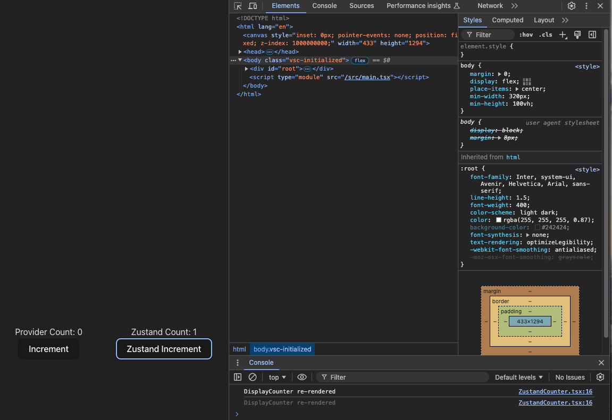
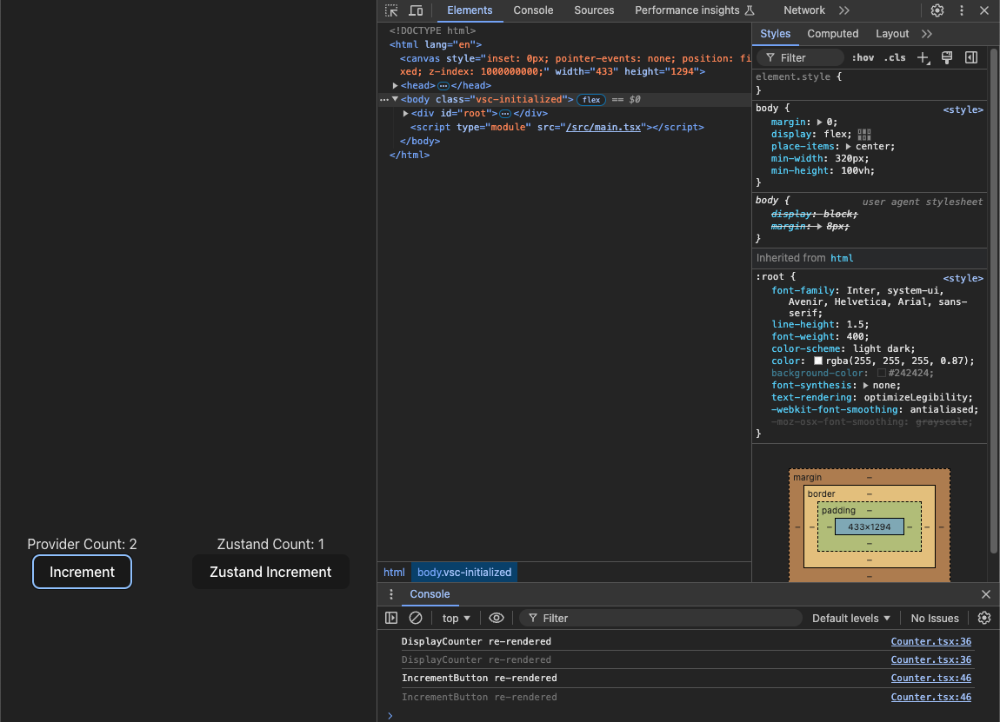

## Counter App

The purpose of using zustand instead of React's useContext is the simplicity in managing client side state and the performance implications.

Zustand only re-renders the component that consumes the changing state. While useContext re-renders all the components that use it.

### Zustand Counter

### useContext Counter

