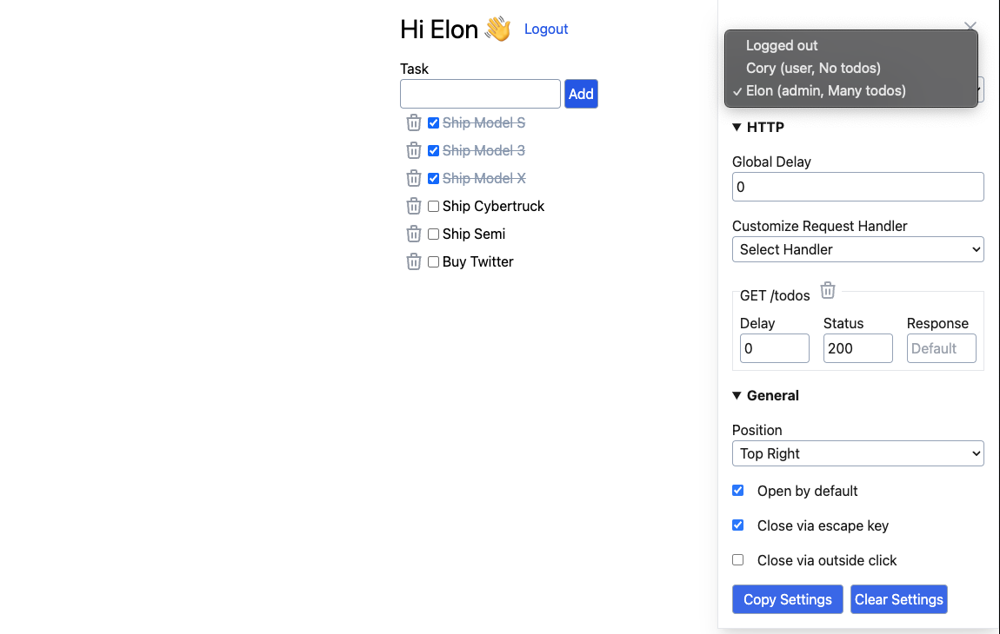
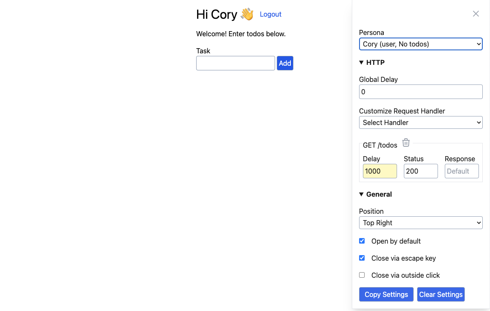
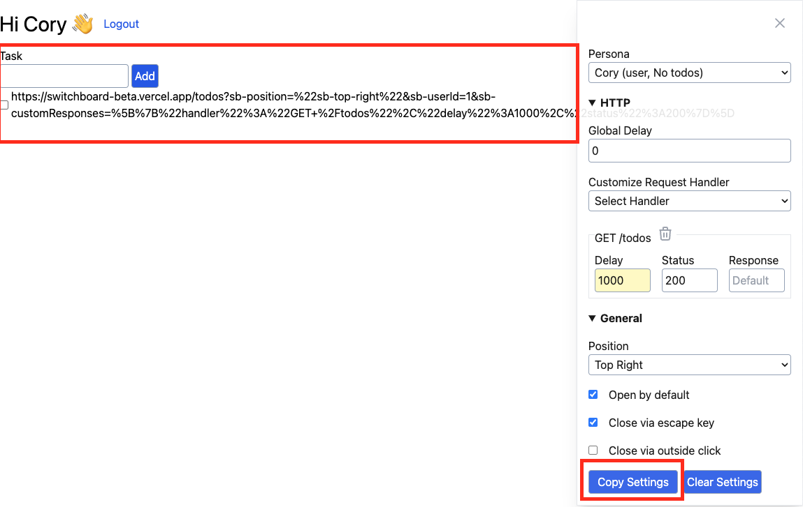

## Custom Dev Tools

The idea behind using a custom dev tool is to reproduce settings that maybe hard to create manually. By doing so, different tests scenerios can be re-created and tested.

### Logging in as different personas

### Delaying Requests

### Reproducing Settings via Copying Url

## Examples

https://github.com/coryhouse/switchboard-with-vite-demo
https://switchboard-beta.vercel.app/todos
